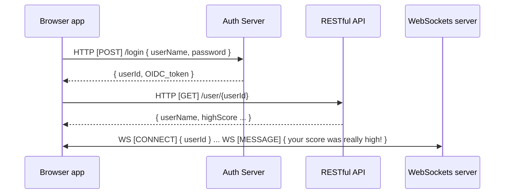

SE 3190: Construction of User Interfaces  
Fall 2024  
Final Project Proposal

# SE 3190 Final Project Proposal: Team #19  <!-- omit from toc --> 

- Nathanial Boehlje - nboehlje@iastate.edu
- Nathan Willimack - nawilli@iastate.edu
- 11/17/2024

## Table of Contents  <!-- omit from toc --> 

- [1. Description](#1-description)
  - [1.1. Introduction](#11-introduction)
  - [1.2. Objectives](#12-objectives)
- [2. User Experience](#2-user-experience)
  - [2.1. Visual Representations \& View Descriptions](#21-visual-representations--view-descriptions)
    - [2.1.1. Home Page:](#211-home-page)
    - [2.1.2. Game play Page:](#212-game-play-page)
    - [2.1.3. Profile Page:](#213-profile-page)
    - [2.1.4. leader-board Page:](#214-leader-board-page)
    - [2.1.5. Interactive Chat Page:](#215-interactive-chat-page)
- [3. File Structure and Management](#3-file-structure-and-management)
  - [3.1. File Descriptions](#31-file-descriptions)
    - [3.1.1. `HTML` Files](#311-html-files)
    - [3.1.2. `CSS` Files](#312-css-files)
    - [3.1.3. `JSON`](#313-json)
    - [3.1.4. `JavaScript`, `js` and `JSX` Files](#314-javascript-js-and-jsx-files)
- [4. Data sources and Management](#4-data-sources-and-management)
  - [4.1. Data Sources](#41-data-sources)
  - [4.2. Data Format and Processing](#42-data-format-and-processing)
  - [4.3. Data Flow and Transformation](#43-data-flow-and-transformation)


## 1. Description

### 1.1. Introduction

Trying to keep you mind stress-free while waiting for something personally significant to occur can be challenging, sometimes the most effective way to reduce stress is by engaging in a healthy distraction.

Simple, browser-based games can be an enjoyable way to spend time while sitting in a waiting room or attempting to clear you nerves before an important presentation. For example, waiting at the doctor's office or taking a small break right before you deliver a stressful update on your project at work. 

### 1.2. Objectives

1. To develop an entertaining browser game that will provide a small (non-addictive) distraction to players. I.e. provide a small dose of joy to ease the mind before a potentially stressful event.

2. The game should be interactive and simple. It should also support player personalization and recognition of achievement.

3. Develop an interactive space travel game where the user provides input through their keyboard to direct a spaceship through a field of asteroids.
    1. Users will navigate their ship by pressing the right and left arrow keys.
    2. Users can shoot at the asteroids to destroy them, by pressing the space key.
    3. The game ends when the ship is struck by an asteroid OR 5 minutes has elapsed.

4. Develop personalized player experience.
    1. Allow users to create a custom user profile and upload a photo of themselves on a "profile" page.
    2. The users will be able to enter a username, upload a photo, and register their email for optional leader-board updates. 

5. Develop a leader-board page where users can view their 10 highest scores. (Recognition of player achievement)
    1. The leader-board will be interactive. Users will not have to reload the page to see updated scores. 
   
6. Develop a live-chat experience where players can send messages in real-time to one another. 
   1. A user can initiate a chat session by entering a username to deliver the chat message. 
   2. A user can initiate a chat session by selecting someone on the leader-board to chat with.
   3. The user receiving the message can accept or dismiss the incoming chat request.   

7. Develop 5 web pages:
    1. A main/central page with information about the game and links to the 3 other pages.
    2. The game surface page, where the user plays the game. 
    3. A profile page where the user can view and edit their profile information.
    4. A leader-board page where users can view their top 10 highest scores. 
    5. A player chat page where players can send live chat messages to each other. 

## 2. User Experience 

### 2.1. Visual Representations & View Descriptions
 

The game will be a "space invaders" style shooter where the user directs their ship with the right and left arrow keys, clearing the asteroids from the ship's path.

#### 2.1.1. Home Page:
This page will provide information about the game and links to the other pages (game surface, profile, leader-board). It will also have a brief introduction about the game and a "Start Game" button.
Example:
```
+--------------------------------------+
|       2D Pixel Shooter               |
+--------------------------------------+
| [Start Game] [Profile] [leader-board] |
+--------------------------------------+
|       Welcome to the 2D              |
|     Pixel Shooter Game!              |
|    Navigate your spaceship           |
|   and destroy the asteroids!         |
+--------------------------------------+
```

#### 2.1.2. Game play Page:
The core game-play area, where users will control their spaceship, shoot asteroids, and track their score and time. The page will also show player health status at the top.
Example:
```
+------------------------------------+
| Player Health: 100 | Time: 00:00   |
+------------------------------------+
|                                    |
|                                    |
|         [Spaceship]                |
|                                    |
|         *Asteroids*                |
|                                    |
+------------------------------------+
```

#### 2.1.3. Profile Page:
This page will allow users to create and update their profiles, including uploading a profile picture. There will be fields for the username and a button to save changes.
Example:
```
+-----------------------------+
|         Profile Page        |
+-----------------------------+
|  [Profile Picture]          |
|  [Upload New Picture]       |
|                             |
|  Username: [______]         |
|                             |
|  [Save Changes]             |
+-----------------------------+
```

#### 2.1.4. leader-board Page:
The leader-board page will display the top 10 highest scores, showing the player's username and their score.
Example:
```
+-----------------------------+
|        leader-board          |
+-----------------------------+
|  1. Username1 - Score1      |
|  2. Username2 - Score2      |
|  3. Username3 - Score3      |
|  ...                        |
|  10. Username10 - Score10   |
+-----------------------------+
```

#### 2.1.5. Interactive Chat Page: 

Players can exchange message with each other by typing a message in the box and pressing the send button. 

A player can be selected as a recipient of a message by clicking the "send message" button on the leader-board or by entering the username of another player. 

```
+-----------------------------+
|        Player chat          |
+-----------------------------+
|           Bob               |
|--------------+              |
|  great game! |              |
|--------------+              |
|                  alice      | 
|                 +-----------|
|                 | thanks!   | 
|                 +-----------|
|                             |
|  [type something...] (Send) |
+-----------------------------+
```

## 3. File Structure and Management

### 3.1. File Descriptions 

#### 3.1.1. `HTML` Files

Hypertext Markup Language files are used for rendering visual content within a web browser. Typically each HTML file represents one web "page", a scrollable view with text images or other visual content such as 3-D graphics. 

HTML markup is composed of building blocks called elements.  

We will only have one HTML file called `index.html` which will be the entrypoint of our application. 

#### 3.1.2. `CSS` Files

Cascading Style Sheets are used to impart visual styles to HTML elements. For example placing a boarder around a block of text, or changing the background color of a HTML element. 

We will have one global stylesheet called `styles.css` which will be applied across all the views. 

#### 3.1.3. `JSON`  

Javascript Object Notation is simply a textual data storage format. It uses special sequences of UTF-8 encoded characters to define data structures. E.g., `"numbers": [ 1, 2, 3 ]` represents an array of integers called `numbers`. 

No JSON files will be stored in the project directory as all the application data will be sourced from the database. 

#### 3.1.4. `JavaScript`, `js` and `JSX` Files

JavaScript is a programming language that can be embedded inside HTML files to give "behavior" to the web page. For example JavaScript could be used to change the color of a button when it is pressed by the user. Another use case is making network requests to get some data from a server without requiring the user to reload the page. 

JSX is a file format for using HTML strings within a JavaScript file, without requiring escape sequences and messy string interpolation. It is used by the React framework for creating components, which are basically independent UI objects. 

There will be a JavaScript file for each view containing the components for that page. 

## 4. Data sources and Management 

### 4.1. Data Sources 

The application data is mostly user-generated and consists of 3 main catagories. 

1. **User Profile Information**
   1. Data about the user such as username, email, their profile image. 
2. **Ephemeral chat data**
   1. Players can send real-time messages to each other. 
3. **Game leader-board scores**
   1. This is really a combination of game metadata and user profile information.

### 4.2. Data Format and Processing 

The format of the data will be JSON pretty much everywhere. WebSockets supports JSON and most HTTP requests will be JSON excluding the initial request for the SPA and images.

We may employ binary WebSockets payloads for efficiency where the data is not intrinsically textual.

### 4.3. Data Flow and Transformation

Data flow in our application can be separated into 2 main types. Realtime (stateful), and RESTful. 

The **realtime** flow involves receiving WebSockets messages from a browser and delivering them to another browser client if that particular client has an active connection. WebSockets messages are also asynchronously written a database to enable a persistent chat history across sessions.

The **RESTful** flow represents a standard HTTP API application interface, where browser clients request data using standard HTTP verbs (GET, POST, PUT, DELETE) on API resources. The endpoints exposed here are commonly called CRUD (Create Read Update Delete) endpoints. 

Here's an example of a typical messaging sequence between our backend and a browser client.





